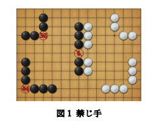
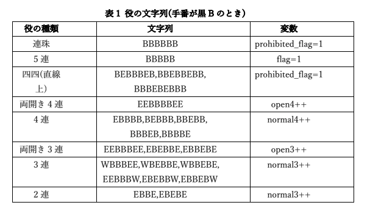
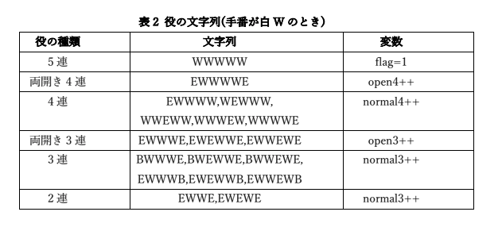

# 五目並べAIを作ってみた
- Unityを使って五目並べを一から実装し，さらに着手の先読みを実装した五目並べAIに拡張した

## 五目並べ
- 15×15路の盤面
- 黒石が先手，白石が後手
- 先手の黒石には，以下の禁じてを設けた
  - 三三連：同時に複数の三連を作る
  - 四四連：同時に複数の四連を作る
  - 六連：六つ以上の石を連ねる\

- 役の判定には，line_nbr関数を用いており，それぞれ文字列で管理している
  - 黒石：B，白石：W, 空白：E\
  \
  

## AI部分の実装
- 着手の先読みをする探索アルゴリズムとして，Minimax法を採用した．
- 効率化を図るために，alpha-beta法による枝刈りを行う．
- また，枝の数を減らすために，以下の実装を施している．\
  1. 次の着手位置として考慮するのは，周辺に石がある領域に限定
  2. 五連を作れるなら，その位置のみ考慮する
  3. 相手のリーチ(防がないと相手の勝利が確定する)となったなら，それを防ぐ位置のみ考慮する
  4. 相手のリーチになっておらず，自分のリーチを取れるなら，その位置のみ考慮する
  5. 考慮する着手位置は，自身の石の二連を作れる or 相手の石の二連を防げる位置のみ